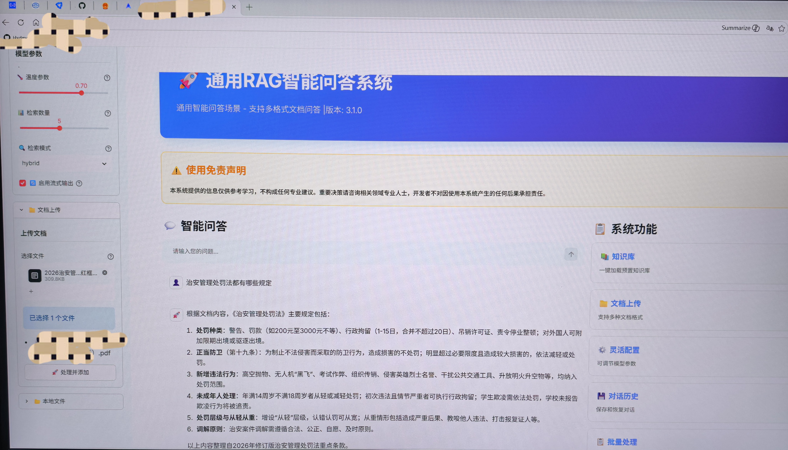

🤖 通用 RAG 智能问答系统 (v3.1.0)

> **项目定位**：基于本地大模型与 RAG（检索增强生成）技术的垂直领域知识库问答平台。
> **核心技术**：LLM + Vector Database + Hybrid Search + Streamlit
> **当前状态**：✅ 核心功能已跑通 | ✅ Windows 一键部署脚本已封装

## 📸 系统运行实录

下图展示了系统在加载《治安管理处罚法》知识库后的实际问答效果。系统成功识别了复杂的法律条文，并针对“处罚规定”进行了结构化总结。


### 💡 界面功能解析
- **左侧参数控制台**：支持实时调节 `Temperature` (0.70) 控制回答创造性，调节 `Top-K` (5) 控制检索召回数量；支持 Hybrid (混合) 检索模式切换。
- **中间流式对话区**：采用流式输出技术，降低首字延迟；针对法律条文进行了分点陈述（如处罚种类、正当防卫界定），可读性强。
- **右侧功能导航**：集成了知识库管理、文档上传、历史记录回溯等模块化功能。

---

## 🛠️ 技术架构与实现细节

本项目不仅仅是一个 Demo，更是一个完整的 RAG 工程化实践：

### 1. 数据处理流水线
- **文档解析**：支持 PDF/Word/Txt 多格式解析，自动提取文本内容。
- **文本分块**：采用滑动窗口机制进行 Chunking，保留上下文语义完整性。
- **向量化**：调用本地 Embedding 模型将文本转化为高维向量存入向量数据库。

### 2. 检索增强生成策略
- **混合检索**：结合了 **关键词检索** 与 **向量语义检索**，解决单一检索在专业术语匹配上的不足。
- **重排序**：对召回的文档块进行相关性打分，确保喂给大模型的 Context 最精准。

### 3. 工程化部署
- **全脚本化启动**：编写了 `.bat` 批处理脚本，自动检测环境、激活虚拟环境、启动后端服务，实现了“双击即用”。
- **前后端分离**：前端采用 Streamlit 快速构建交互界面，后端通过 API 与大模型及向量库通信。

---

## 🚀 快速启动指南 (Windows)

为了降低演示门槛，项目已封装好所有启动脚本：

1. **克隆仓库**：`git clone <https://github.com/Hxdmou/-embodied-intelligence-demo/
tree/main>`
2. **主入口**：双击运行 `Demo启动菜单.bat`
3. **功能选择**：
   - 输入 `1` 启动 RAG 问答系统
   - 输入 `2` 启动 PyBullet 物理仿真
   - 输入 `3` 启动训练好的智能体

## 📂 目录结构说明

```text
├── Demo启动菜单.bat       # [主入口] 交互式启动脚本
├── 一键启动RAG系统.bat    # [核心] 启动 Web 问答界面
├── start_demo.bat         # 备用启动脚本
├── rag.py                 # RAG 核心逻辑代码
├── requirements.txt       # 依赖包列表
└── README.md              # 项目说明文档
