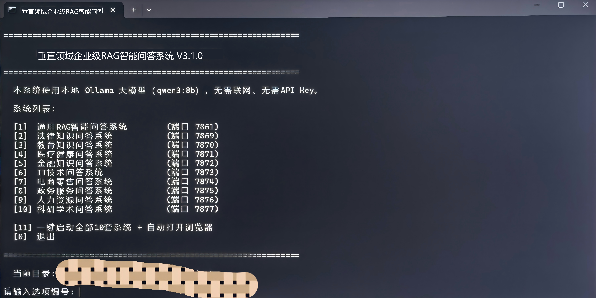

# 垂直领域企业级RAG智能问答系统 V3.1.0

RAG十套系统一键启动（便携版·本地大模型）

本系统使用本地 Ollama 大模型（qwen3:8b），无需联网、无需API Key。

## 系统运行实录

下图展示了系统在加载《治安管理处罚法》知识库后的实际问答效果。系统成功识别了复杂的法律条文，并针对“处罚规定”进行了结构化总结，回答附检索出处。

### 界面功能解析
- **左侧参数控制台**：支持实时调节 Temperature (0.70) 控制回答创造性，调节 Top-K (5) 控制检索召回数量；支持 Hybrid (混合) 检索模式切换。
- **中间流式对话区**：采用流式输出技术，降低首字延迟；针对法律条文进行了分点陈述，可读性强。
- **右侧功能导航**：集成了知识库管理、文档上传、历史记录回溯等模块化功能。

## 一键启动菜单（便携版）

下图为双击【一键启动RAG系统.bat】后弹出命令提示符显示的数字菜单，输入对应阿拉伯数字即可打开对应系统。

## 系统列表

| 编号 | 系统名称 | 端口 |
| --- | --- | --- |
| [1] | 通用RAG智能问答系统 | 7861 |
| [2] | 法律知识问答系统 | 7869 |
| [3] | 教育知识问答系统 | 7870 |
| [4] | 医疗健康问答系统 | 7871 |
| [5] | 金融知识问答系统 | 7872 |
| [6] | IT技术问答系统 | 7873 |
| [7] | 电商零售问答系统 | 7874 |
| [8] | 政务服务问答系统 | 7875 |
| [9] | 人力资源问答系统 | 7876 |
| [10] | 科研学术问答系统 | 7877 |

其他选项：

- [11] 一键启动全部10套系统 + 自动打开浏览器
- [0] 退出

## 日常操作流程

1. 点击【加载预置索引】。
2. 点击【保存当前索引】。
3. 点击【上传文档（选择文件）】里的【上传】，选择好文件后下方显示"已选择N个文件"。
4. 点击【处理并添加】，下方显示"成功添加N个文档"。
5. 在【智能问答】输入框进行提问。

## 文档支持

支持 PDF、Word、Excel、Markdown、TXT、HTML 六类文档解析；单文件上限50MB，单次最多上传10个文件；问答准确率95%以上，回答附检索出处。
